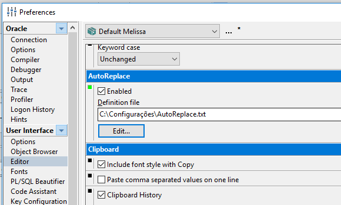
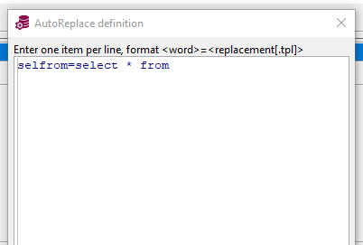

[Ir para PL/SQL](plsql.md)

# Auto Replace

Substitui uma "palavra" por outra. Bom para digitar menos.

Uso muito esse do exemplo, ao invés de sempre digitar `select * from ` digito apenas `selfrom `.

## Configuração

## Funcionando

