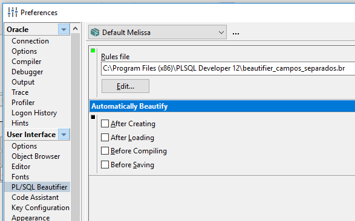
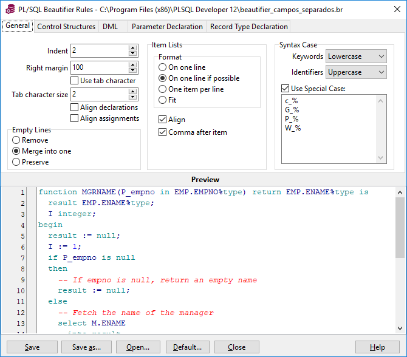
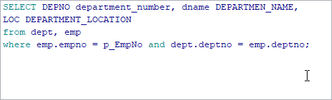

[Ir para PL/SQL](plsql.md)

# Beautifier

Seus selects são belos ou uma bela bagunça?

Para melhorar as coisas com apenas um atalho, você pode acionar o Beautifier.

## Faça você mesmo

Como cada um tem seus próprios padrões, ou trabalha em algum lugar que segue padrão de comandos, a tela para configurar fica nos caminhos abaixo (divirta-se):

## Feito no meu padrão

Agora se você não tem um padrão e algum padrão já serve é só pegar o arquivo `.br` que desejar:

Arquivo                              | Descrição
:------------------------------------|:---------
[beautifier.br](arquivos/beautifier.br) | Campos do `select` por linha, `select`, `from`, `where`, `and` e `or` alinhados à direita
[beautifier-campos-separados.br](arquivos/beautifier-campos-separados.br) | Campos do `select` na mesma linha (limitada em 90 caracteres)

## Funcionando

