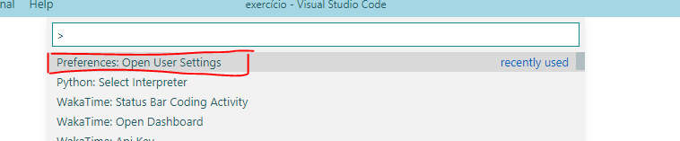

[Ir para Python](python.md)

# PyLint + VS Code

## Desabilitar *hint* de docstrings

1. Abra as configurações do seu VS Code (arquivo settings.json)

> **Como mudar configurações no VS Code?**
>
> use o atalho <kbd>Ctrl</kbd> + <kbd>Shift</kbd> + <kbd>P</kbd> e busque por Settings e escolha a opção da imagem abaixo:
> 
> 

2. Inserir os códigos que te avisam que você não inseriu *docstrings*:

```
"python.linting.pylintArgs": [
        "--disable=C0111,C0112"
    ]
```
> **Códigos do Exemplo**
>
> C0111: Missing %s docstring
> C0112: Empty %s docstring
>
> Para mais informações sobre todos os códigos, ver na documentação [PyLint Messages](http://pylint-messages.wikidot.com/all-codes)
