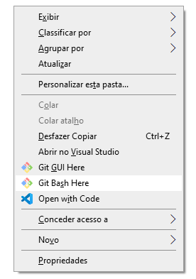

[Ir para Python](python.md)

# Configurações no Windows

Passo a passo para um ambiente similar ao que usei no AceleraDev Python da Stone.

## Características

- Windows 10
- Python 3
- Visual Studio Code (VS Code)

## Passos para configurar

1. No VS Code instalar a extensão Python.

2. Instalar o Python na última versão, pelo [site oficial](https://www.python.org/).
   Seguir as instruções no padrão "next-next", e quando for dada a opção de configurar o Path, marcar sim. Isso faz o trabalho ficar mais fácil, não precisando configurar as variáveis de ambiente depois.

3. Configurar dentro do VS Code o interpretador, usei o padrão do Python para simplificar, assim foi só indicar o caminho do executável do Python usando o atalho `Ctrl` + `Shift` + `P` na opção *Python: Select Interpreter*.

4. Caso o VS Code te dê instruções para instalar mais alguma extensão ou complemento, siga as intruções dele.

Está feito! Já é possível fazer o primeiro "Hello World!"

## Bônus - Configurar Virtualenv

Para executar esses comandos você pode usar o [Git Bash](https://gitforwindows.org/), depois de instalado, dentro da pasta que quer configurar o ambiente, clique com o botão direito na opção "Git Bash Here"

### Instalar

`pip3 install virtualenv`

### Criar um ambiente virtual

`virtualenv [nome do ambiente virtual] -p python3`

### Ativar

`source [nome do ambiente virtual]/Scripts/activate`

### Instalação de dependências

`pip install -r requirements.txt`

### Sair do ambiente virtual

`deactivate`
